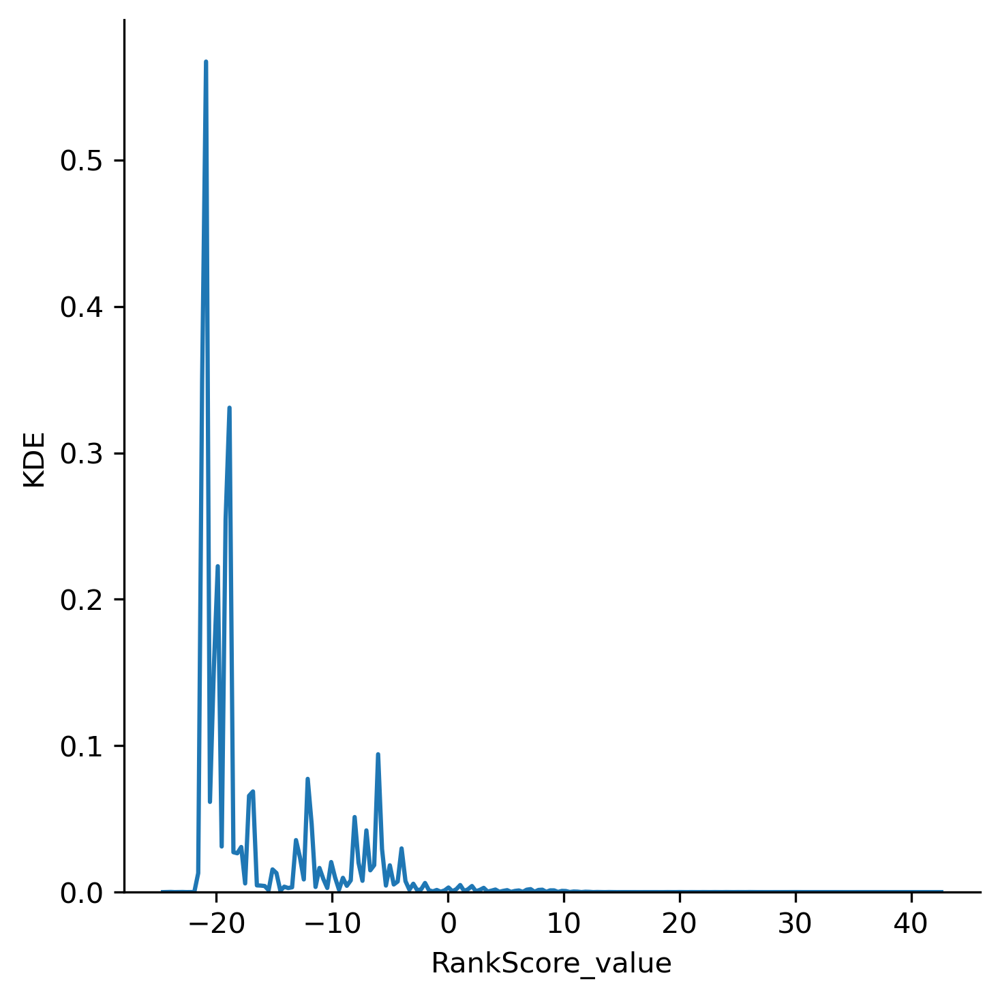
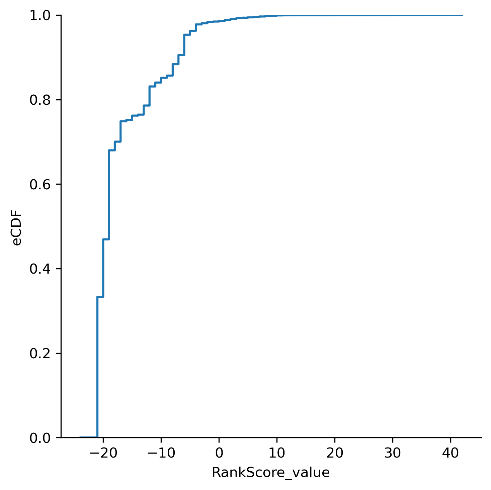
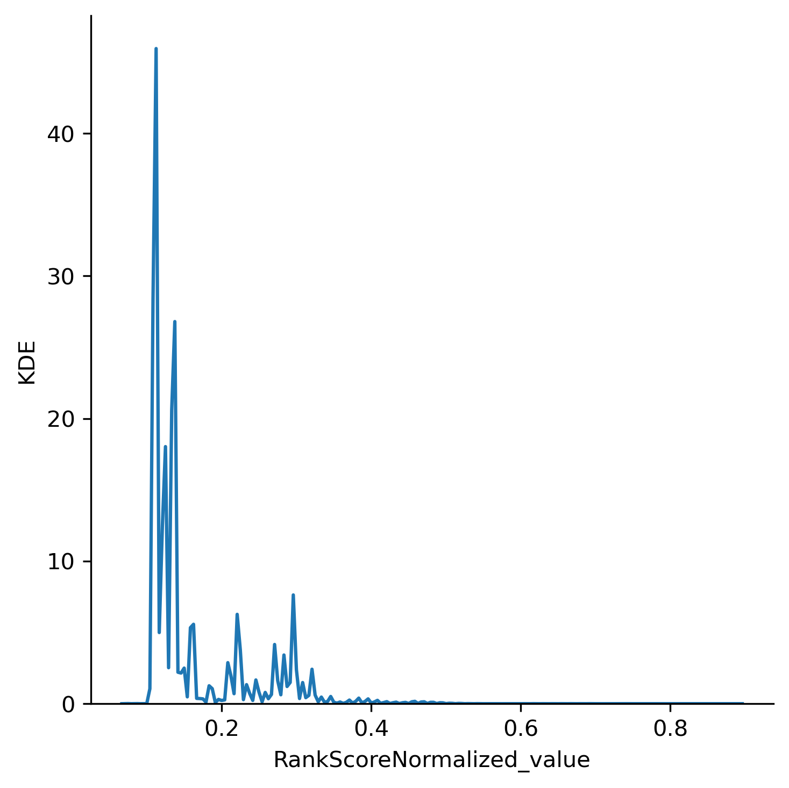
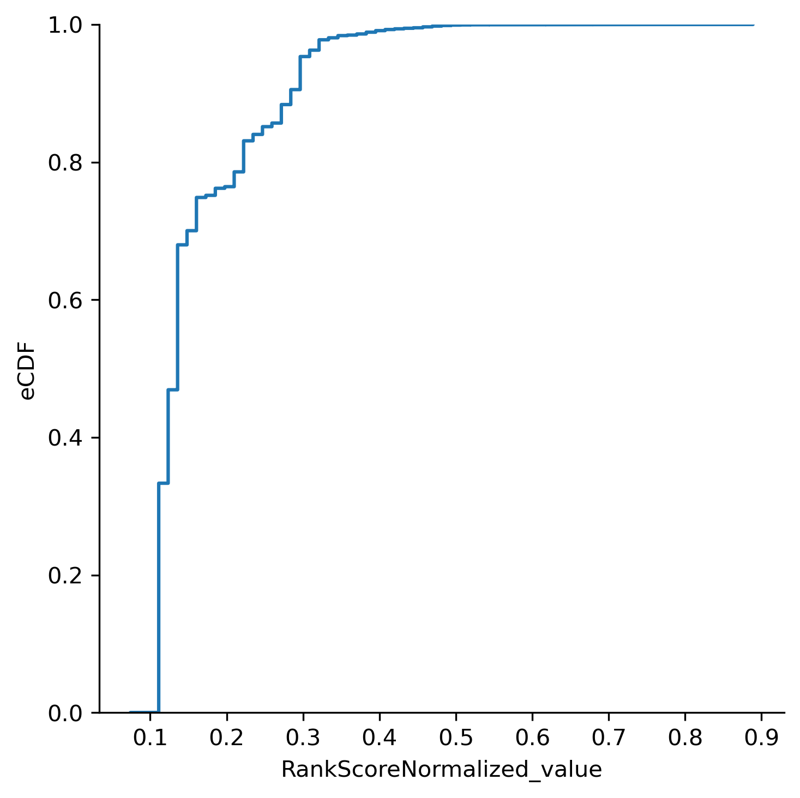
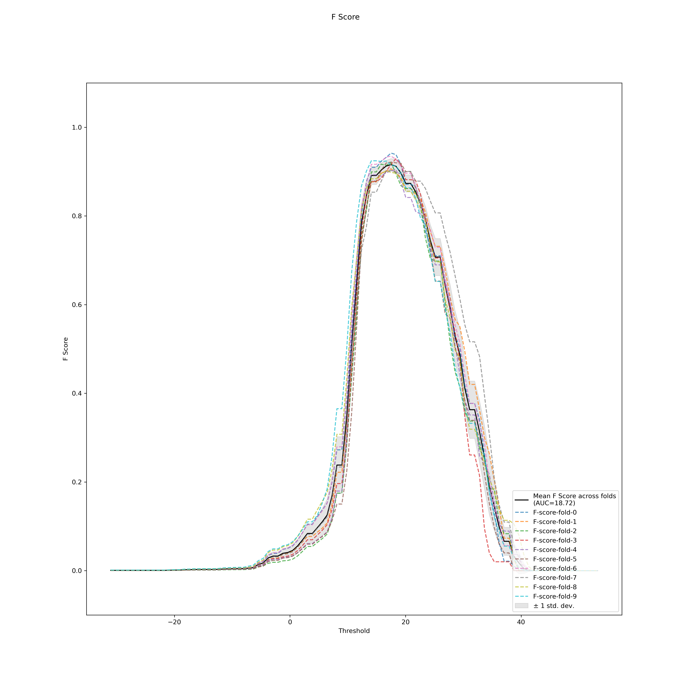
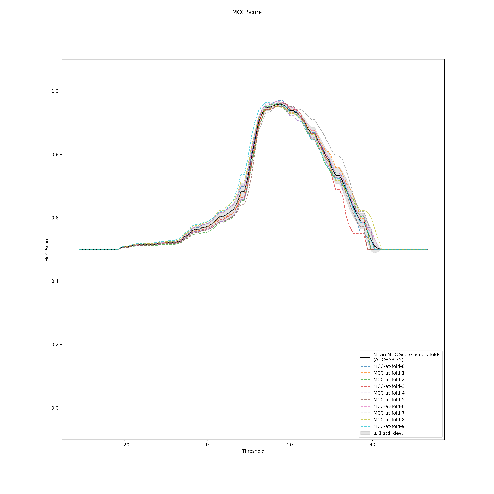
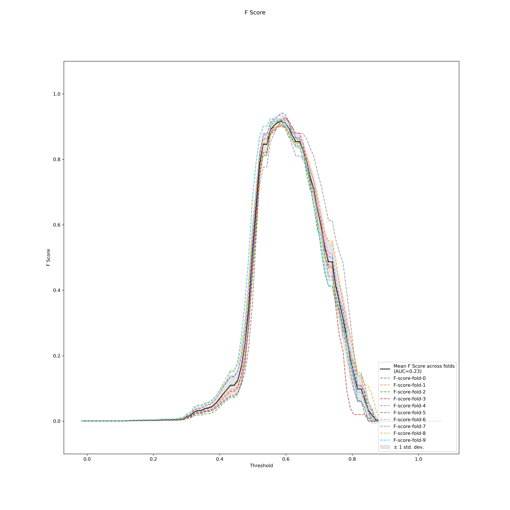
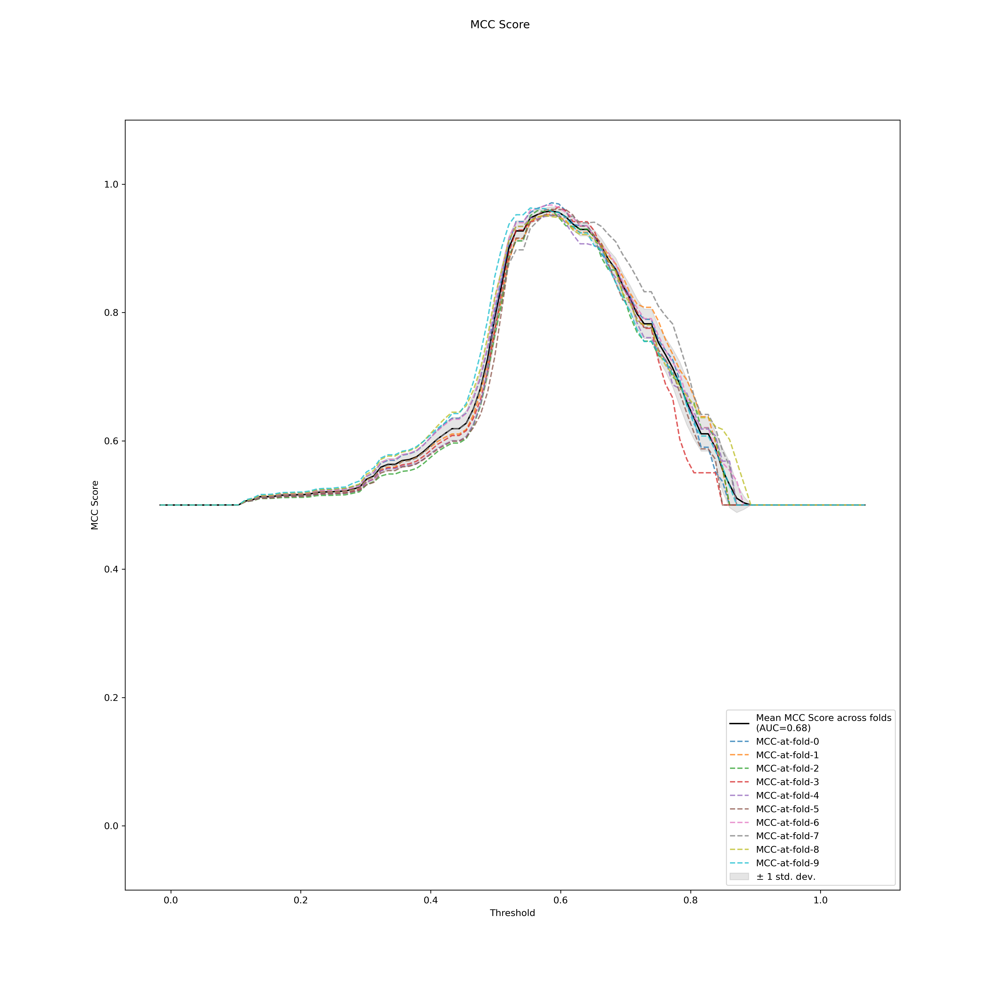
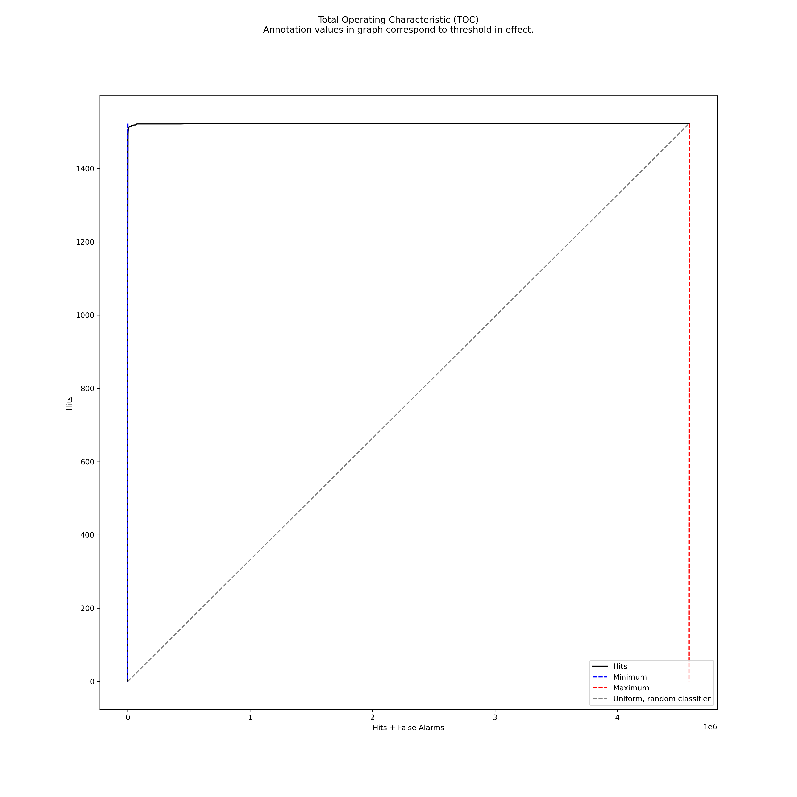

# Genmod v0.0.0 Validation Report

This report was put together using this module.

## Test Fixture

### Reference Versions
`genmod_v3.7.3`
is the version of Genmod used to compute a reference dataset
to be compared against.

`MIP v11.2.2`
is the version of MIP pipeline that generated the annotated VCF files
used for input to `genmod?` for generating the reference data.

### Dataset(s)
* MUTACC database for ground truth `mutacc-20230512_truth`.
* Validation data set for `MIP v11.2.2` as input to `MIP` pipeline.

## Genmod Version Under Test
```
0e977d2cac0dbb724570dcae67079a1f8fae57ca (rankscore-normalization) Variant Rank Score Normalization
```
<span style="color:red;">**NOTE**: This branch has not yet been merged to `master`.</span>

## Test Execution
Run the following command in the devenv singularity container:
`src/rdds/exploration_rankscore/rankscore-data-analysis.sh`.

Uncomment selected parts of the shellscript to compile, analyze datasets.

Run results are stored in `./tmp/exploration-rankscore`

## Results

The results section is divided into two parts, SV and SNV since the underlying data behavior is expected to differ.

### Reference Dataset Compilation
```
Compiling /rdds/tmp/rankscore-eval/genmod_v3.7.3/mutacc-20230512_gatkcomb_rhocall_norm_af_mt_frqf_cadd_vep_parsed_ranked.vcf.gz ->
/rdds/tmp/exploration-rankscore/mutacc-20230512_gatkcomb_rhocall_norm_af_mt_frqf_cadd_vep_parsed_ranked.vcf.gz-ref.hd5['RankScore']
Dataset /rdds/tmp/exploration-rankscore/mutacc-20230512_gatkcomb_rhocall_norm_af_mt_frqf_cadd_vep_parsed_ranked.vcf.gz-ref.hd5 generation complete
```

### SNV
```
Compiling /rdds/tmp/rankscore-eval/snv_indel/genmod_compound/mutacc-20230512_gatkcomb_rhocall_norm_af_mt_frqf_cadd_vep_parsed.annotate_models_score_compund.vcf ->
/rdds/tmp/exploration-rankscore/mutacc-20230512_gatkcomb_rhocall_norm_af_mt_frqf_cadd_vep_parsed.annotate_models_score_
compund.vcf-snv.hd5['RankScore', 'RankScoreNormalized', 'RankScoreMinMax']
/.../
Dataset /rdds/tmp/exploration-rankscore/mutacc-20230512_gatkcomb_rhocall_norm_af_mt_frqf_cadd_vep_parsed.annotate_models_score_compund.vcf-snv.hd5 generation complete
Adding MUTACC true positive cases from /rdds/tmp/rankscore-eval/mutacc-20230512_truth/causative-variants.vcf.gz
Ratio of TP variants in dataset: 0.0003320433858396468, dropped 0.08856971873129862 of MUTACC true positive causative variants
Addition of MUTACC variants complete.
```

#### Rankscore Integrity Test
Comparison results of `RankScore` with previous genmod version (`testnormalizedrankscore` option):
```
# DATASET UNDER TEST
/rdds/tmp/exploration-rankscore/mutacc-20230512_gatkcomb_rhocall_norm_af_mt_frqf_cadd_vep_parsed.annotate_models_score_compund.vcf-snv.hd5::structured_vcfs:
/rdds/tmp/exploration-rankscore/mutacc-20230512_gatkcomb_rhocall_norm_af_mt_frqf_cadd_vep_parsed.annotate_models_score_compund.vcf-snv.hd5::structured_vcfs/RankScoreMinMax_max: shape=(4586750, 1) dtype=float32
/rdds/tmp/exploration-rankscore/mutacc-20230512_gatkcomb_rhocall_norm_af_mt_frqf_cadd_vep_parsed.annotate_models_score_compund.vcf-snv.hd5::structured_vcfs/RankScoreMinMax_min: shape=(4586750, 1) dtype=float32
/rdds/tmp/exploration-rankscore/mutacc-20230512_gatkcomb_rhocall_norm_af_mt_frqf_cadd_vep_parsed.annotate_models_score_compund.vcf-snv.hd5::structured_vcfs/RankScoreNormalized_family_id: shape=(4586750, 1) dtype=|S128
/rdds/tmp/exploration-rankscore/mutacc-20230512_gatkcomb_rhocall_norm_af_mt_frqf_cadd_vep_parsed.annotate_models_score_compund.vcf-snv.hd5::structured_vcfs/RankScoreNormalized_value: shape=(4586750, 1) dtype=float32
/rdds/tmp/exploration-rankscore/mutacc-20230512_gatkcomb_rhocall_norm_af_mt_frqf_cadd_vep_parsed.annotate_models_score_compund.vcf-snv.hd5::structured_vcfs/RankScore_family_id: shape=(4586750, 1) dtype=|S128
/rdds/tmp/exploration-rankscore/mutacc-20230512_gatkcomb_rhocall_norm_af_mt_frqf_cadd_vep_parsed.annotate_models_score_compund.vcf-snv.hd5::structured_vcfs/RankScore_value: shape=(4586750, 1) dtype=float32
/rdds/tmp/exploration-rankscore/mutacc-20230512_gatkcomb_rhocall_norm_af_mt_frqf_cadd_vep_parsed.annotate_models_score_compund.vcf-snv.hd5::structured_vcfs/alt: shape=(4586750, 1) dtype=|S128
/rdds/tmp/exploration-rankscore/mutacc-20230512_gatkcomb_rhocall_norm_af_mt_frqf_cadd_vep_parsed.annotate_models_score_compund.vcf-snv.hd5::structured_vcfs/chrom: shape=(4586750, 1) dtype=|S128
/rdds/tmp/exploration-rankscore/mutacc-20230512_gatkcomb_rhocall_norm_af_mt_frqf_cadd_vep_parsed.annotate_models_score_compund.vcf-snv.hd5::structured_vcfs/label: shape=(4586750, 1) dtype=float32
/rdds/tmp/exploration-rankscore/mutacc-20230512_gatkcomb_rhocall_norm_af_mt_frqf_cadd_vep_parsed.annotate_models_score_compund.vcf-snv.hd5::structured_vcfs/pos: shape=(4586750, 1) dtype=int64
/rdds/tmp/exploration-rankscore/mutacc-20230512_gatkcomb_rhocall_norm_af_mt_frqf_cadd_vep_parsed.annotate_models_score_compund.vcf-snv.hd5::structured_vcfs/ref: shape=(4586750, 1) dtype=|S128
/rdds/tmp/exploration-rankscore/mutacc-20230512_gatkcomb_rhocall_norm_af_mt_frqf_cadd_vep_parsed.annotate_models_score_compund.vcf-snv.hd5::structured_vcfs/variant_ids: shape=(4586750, 1) dtype=|S128
# REFERENCE DATASET
/rdds/tmp/exploration-rankscore/mutacc-20230512_gatkcomb_rhocall_norm_af_mt_frqf_cadd_vep_parsed_ranked.vcf.gz-ref.hd5::structured_vcfs:
/rdds/tmp/exploration-rankscore/mutacc-20230512_gatkcomb_rhocall_norm_af_mt_frqf_cadd_vep_parsed_ranked.vcf.gz-ref.hd5::structured_vcfs/RankScore_family_id: shape=(4586750, 1) dtype=|S128
/rdds/tmp/exploration-rankscore/mutacc-20230512_gatkcomb_rhocall_norm_af_mt_frqf_cadd_vep_parsed_ranked.vcf.gz-ref.hd5::structured_vcfs/RankScore_value: shape=(4586750, 1) dtype=float32
/rdds/tmp/exploration-rankscore/mutacc-20230512_gatkcomb_rhocall_norm_af_mt_frqf_cadd_vep_parsed_ranked.vcf.gz-ref.hd5::structured_vcfs/alt: shape=(4586750, 1) dtype=|S128
/rdds/tmp/exploration-rankscore/mutacc-20230512_gatkcomb_rhocall_norm_af_mt_frqf_cadd_vep_parsed_ranked.vcf.gz-ref.hd5::structured_vcfs/chrom: shape=(4586750, 1) dtype=|S128
/rdds/tmp/exploration-rankscore/mutacc-20230512_gatkcomb_rhocall_norm_af_mt_frqf_cadd_vep_parsed_ranked.vcf.gz-ref.hd5::structured_vcfs/pos: shape=(4586750, 1) dtype=int64
/rdds/tmp/exploration-rankscore/mutacc-20230512_gatkcomb_rhocall_norm_af_mt_frqf_cadd_vep_parsed_ranked.vcf.gz-ref.hd5::structured_vcfs/ref: shape=(4586750, 1) dtype=|S128
/rdds/tmp/exploration-rankscore/mutacc-20230512_gatkcomb_rhocall_norm_af_mt_frqf_cadd_vep_parsed_ranked.vcf.gz-ref.hd5::structured_vcfs/variant_ids: shape=(4586750, 1) dtype=|S128
# RESULTS
Starting rankscore normalization test
Completed rankscore normalization test, checked 4586750 variants
Starting rankscore data set comparison test
Completed rankscore data set comparison test, checked 4586750 variants
```
Tests passed (i.e. no difference in `RankScore` compared to reference set).


<i><br>RankScore kernel density estimate<br></i>


<i><br>RankScore CDF<br></i>


<i><br>RankScoreNormalized kernel density estimate<br></i>


<i><br>RankScoreNormalized CDF<br></i>

#### Rankscore Optimal Performance Point

<i><br>F1 score<br></i>


<i><br>MCC score<br></i>


<i><br>F1 score<br></i>


<i><br>MCC score<br></i>

```
# RankScore Optimal Point
f_score_auc=18.724395250565674,
roc_auc=0.9998642616095353,
best_operating_thresholds=array([17.48181818]),
scores_at_best_operating_point=array([0.95804226]),
mean_best_operating_threshold=17.481818181818188,
mean_score_at_operating_point=0.9580422619314474)

# RankScoreNormalized Optimal Point
f_score_auc=0.23194892277693868,
roc_auc=0.9998642616095352,
best_operating_thresholds=array([0.58617284]),
scores_at_best_operating_point=array([0.95804226]),
mean_best_operating_threshold=0.5861728438735008,
mean_score_at_operating_point=0.9580422619314474)
```

Converting RankScore optimal threshold in to normalized one:
`(17.48 - (-30.)) / (51. + 30.) = 0.5861728395061729` which is similar to the
`RankScoreNormalized_mean_best_operating_threshold=0.5861728438735008`.


<i><br>Total Operating Recall (TOC) of RankScoreNormalized<br></i>

There are small differences in the way performance metrics are plotted in RankScore vs RankScoreNormalized,
but this is believed to be stemming from difference in numerical accuracy during thresholding (dynamic range differs).
Generally, the performance is the same when comparing RankScore and RankScoreNormalized metrics.

Observing the above plots it's evident that the current rare disease pipeline is well adjusted to the data
set(`ROC-AUC ~=1.0`)). There's a risk that further refining the pipeline on MUTACC dataset will cause overfitting of
the genmod parameters. If this happens, the diagnostic false negative ratio will increase.

### SV
```
Compiling /rdds/tmp/rankscore-eval/sv/genmod_compound/mutacc-20230512_comb_ann_vep_parsed.annotate_models_score_compound.vcf ->
/rdds/tmp/exploration-rankscore/mutacc-20230512_comb_ann_vep_parsed.annotate_models_score_compound.vcf-sv.hd5['RankScore', 'RankScoreNormalized', 'RankScoreMinMax']
/.../
Dataset /rdds/tmp/exploration-rankscore/mutacc-20230512_comb_ann_vep_parsed.annotate_models_score_compound.vcf-sv.hd5 generation complete
Adding MUTACC true positive cases from /rdds/tmp/rankscore-eval/mutacc-20230512_truth/causative-variants.vcf.gz
Ratio of TP variants in dataset: 0.0009338444903175072, dropped 0.9886295631358468 of MUTACC true positive causative variants
Addition of MUTACC variants complete.
```

Comparison results of `RankScore` with previous genmod version (`testnormalizedrankscore` option):
```
Starting rankscore normalization test
Traceback (most recent call last):
  File "/opt/conda/lib/python3.8/runpy.py", line 194, in _run_module_as_main
    return _run_code(code, main_globals, None,
  File "/opt/conda/lib/python3.8/runpy.py", line 87, in _run_code
    exec(code, run_globals)
  File "/rdds/src/rdds/exploration_rankscore/__main__.py", line 63, in <module>
    run_rankscore_normalization_tests(file_path=args.hd5, file_path_ref=args.hd5ref)
  File "/rdds/src/rdds/exploration_rankscore/rankscore_normalization_tests.py", line 115, in run_rankscore_normalization_tests
    test_rankscore_normalization(dataset)
  File "/rdds/src/rdds/exploration_rankscore/rankscore_normalization_tests.py", line 46, in test_rankscore_normalization
    raise ValueError(f'Normalized value outside expected bounds (0, 1) {row}')
ValueError: Normalized value outside expected bounds (0, 1) Pandas(Index=11009, rank_score=-19.0, rank_score_normalized=-0.032786883413791656, rank_score_min=-17.0, rank_score_max=44.0, variant_ids=b'MantaDEL:117077:0:0:0:2:0')
```

**TODO**: Fixup SV Compound subtraction bug (compound subtraction causes RankScore to fall outside MIN,MAX bounds. Update MIN,MAX bounds

COMPOUND:
RankScore=mutacc-20230512:-19.0;RankScoreNormalized=mutacc-20230512:-0.032786885245901634;RankScoreMinMax=mutacc-20230512:-17.0:44.0

SCORE:
RankScore=mutacc-20230512:-13;RankScoreNormalized=mutacc-20230512:0.06557377049180328;RankScoreMinMax=mutacc-20230512:-17.0:44.0

### Conclusions
* SNVs are OK
* MIP pipeline is well fitted to the MUTACC database (with the risk of over fitting to historical data).
