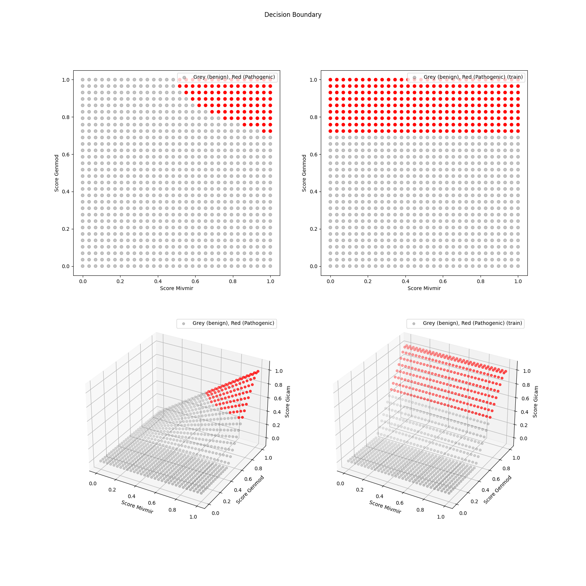

# GICAM
<h3>GENMOD Inheritance and Call Adjustment for MIVMIR</h3>

This module merges inferences from [MIVMIR](../variant_rank_score) and
[GENMOD](https://github.com/Clinical-Genomics/genmod).

GENMOD scoring is configured to a subset rank config related to:
```
- Inheritance mode, genetic model
- Variant call quality
```

In effect, this module will act as a variant filter to improve
precision by reducing FPs.

GICAM was developed using genmod version `v3.10.1`.

## TODOs
- [ ] GICAM module dataset compiler from mivmir-nf pipeline to .hd5 (don't rely on variant rank score module)
- [ ] Add Number Needed to Treat metric, nice alternative when comparing binary output models.
- [ ] Add Likelihood ratio, LR metric to compare model to expected prevalence

## Data Set
GICAM model is fitted to a dataset generated by [mivmir nextflow pipline](https://github.com/Clinical-Genomics/mivmirvalidation).
The output of the pipeline is a .csv file, which is compiled to a .hd5 using VRS model CLI
```
python3 -m rdds.variant_rank_score analyze-mivmir-nextflow-dataset $DDIR/gicaminput/gicamdata.csv $DDIR/oldgenmoddata/genmod_data.csv $DDIR/caseid_map/sample_info.txt --output_file_path tmp/variant-rank-score/mivmirnf-v1.12.0-rc1-18-ge950d18.hd5
```

Dataset contains 300+ patient cases filtered on case specific gene panel,
where the causative variant is marked.

`rdds.gicam train [path-to-hd5]`

## Training
> When retraining model on a new dataset, make sure train/test distributions are comparable.
Do this in the `DatasetLoader.view_data_distributions=True` and modifying `seed` if necessary
for proper data split.

## Design Considerations
GENMOD is not a probabilistic module. Linear response and discrete steps in output score.
Different step magnitude compared to MIVMIR (variant rank score model).

## Model Output

